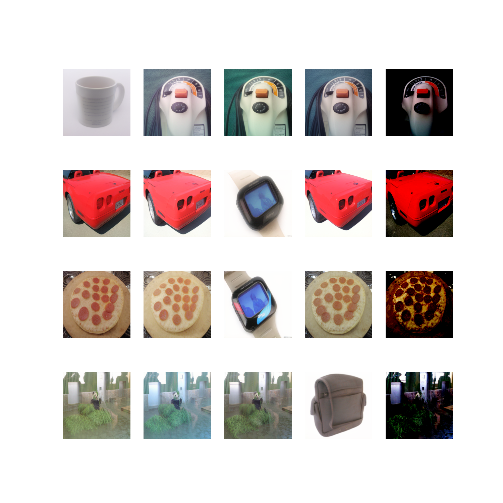

This repository contains code for adapting stable diffusion for EEG to Image task.

The rightmost column is the ground truth image for an EEG Signal and the remaining columns are the generated images for that particular EEG signal.

This model was trained with limited number of iterations [ran out of GPU credits]. Further Improvements are definately possible by simply training for more epochs.

The training also exhibits sudden convergence phenomenon. The fit of the model was pretty bad until 240 iterations but suddenly within the next 10 iterations the model drastically improves as shown in the images below.

  
  
  

  <em>Image 1 Caption</em> • <em>Image 2 Caption</em> • <em>Image 3 Caption</em>

